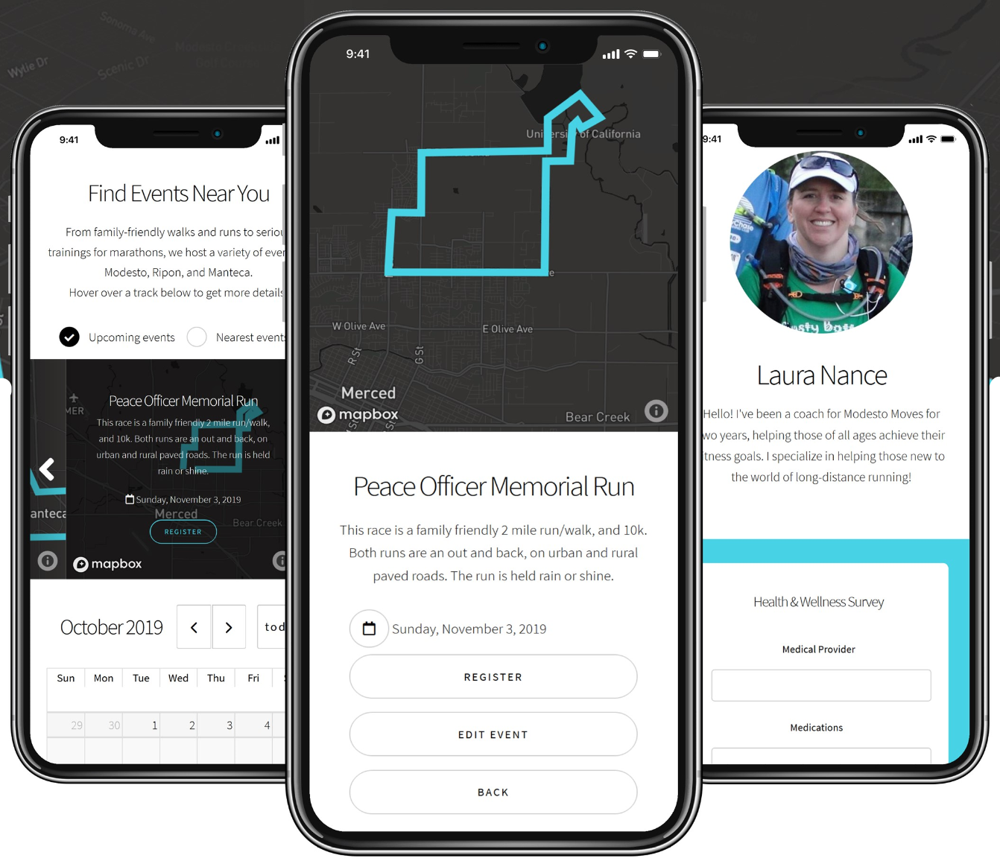

# Modesto Moves
## CSE 120 Final Project

### Collaborators

*Brian Hungerman*, *Brian Sullivan*, *Dan Tran*, *Denis Vashchenko*

## Our Path, Our Mission:

Expediting Modesto Move’s move away from pen-and-paper record-keeping towards an intuitive, all-in-one mobile application.

We aim to ensure participants are safe while providing useful functionalities to make planning and attending events as streamlined as possible.

## Technically Speaking:

Technically Speaking, MotleyMoves is a full-stack solution consisting of a serverless C#.NET Azure Function App connecting our Azure SQL Database to our HTML/CSS/JS web application, integration Google Sign-in and MapBox APIs. 

## Optimizations:

- Leveraged Azure Cloud to track participants, events, and to collect and visualize event telemetry.
- Improved attendance tracking with added incentive system for those who attend many events.
- Embedded safety across all layers of the application, ensuring participants feel comfortable and protected.

## Outcomes:

- Redesigned Modesto Move’s administrative workflow and user experience with a new front-end.
- Built a full-stack solution with scalability in mind to aid in the expansion to neighboring communities.
- Enrolled with Azure Cloud For Nonprofits, which gives $5,000/year in Azure Credits for the back-end.

## Want to Learn more?

More information can be found about Moves Training via their website at MovesTraining.org or via email at MovesTrainingOrg@Gmail.com.